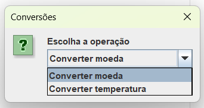
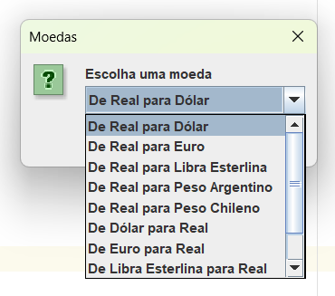
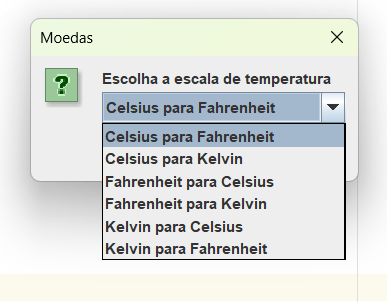

# Conversor - Challenge One 🪙💱

Este é um programa Java que permite aos usuários converter moedas e temperaturas. O programa oferece uma interface simples usando caixas de diálogo Swing para interagir com o usuário. Ele inclui validação de entrada para garantir que os valores inseridos sejam numéricos e fornece opções para escolher entre diferentes moedas e escalas de temperatura.

## 🔺 Funcionalidades

- Conversão de moedas: O programa permite ao usuário escolher entre várias moedas e converter valores entre elas com base em taxas de câmbio pré-definidas.

- Conversão de temperaturas: Os usuários podem escolher entre diferentes escalas de temperatura (Celsius, Fahrenheit, Kelvin) e converter valores entre elas.

- Validação de entrada: O programa verifica se os valores inseridos pelo usuário são numéricos antes de realizar qualquer cálculo de conversão.

- Repetição de operação: O programa permite ao usuário repetir operações de conversão quantas vezes desejar ou encerrar a execução.

## 🔺 Como Usar

1. Execute o programa Java a partir da linha de comando ou de um ambiente de desenvolvimento integrado (IDE) como o Eclipse ou o IntelliJ IDEA.

2. O programa exibirá uma caixa de diálogo solicitando que você escolha a operação (Converter moeda ou Converter temperatura).

3. Se você escolher "Converter moeda", poderá selecionar a moeda de origem e de destino e inserir o valor a ser convertido. Em seguida, o programa mostrará o valor convertido.

4. Se você escolher "Converter temperatura", poderá selecionar a escala de temperatura de origem e de destino e inserir o valor a ser convertido. O programa exibirá o valor convertido.

5. Você pode repetir as operações de conversão quantas vezes desejar ou encerrar o programa.

## 🔺 Demonstração:

 Escolhendo o tipo de conversão:

 Escolhendo a moeda a ser convertida:

 Escolhendo a temperatura a ser convertida:

## 🔺 Requisitos

- Java Development Kit (JDK) oinstalad.
